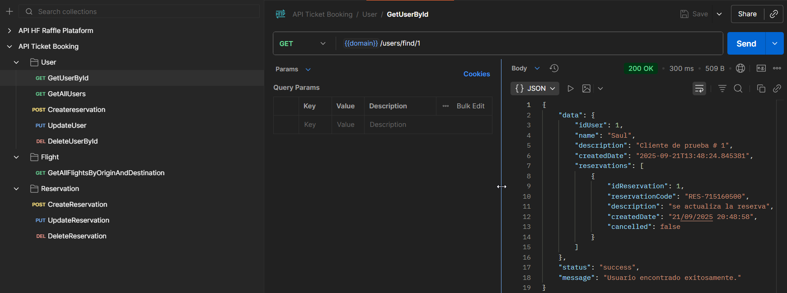
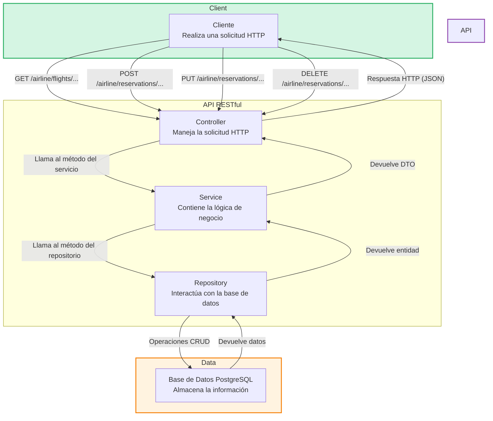

# 📖 GUÍA RÁPIDA DEL PROYECTO: AIRPLANE TICKET BOOKING ✈️
Este proyecto es una **API RESTful** para un sistema de reserva de tiquetes de avión llamado **"Airplane Ticket Booking"**. 
La API permite a los usuarios **buscar vuelos**, **reservar tiquetes** y **gestionar sus reservas** 
(actualizar fechas, cancelarlas).

La arquitectura se basa en el patrón **Modelo-Vista-Controlador (MVC)**, y se enfoca en seguir buenas prácticas de 
desarrollo, incluyendo la implementación de pruebas unitarias para garantizar la calidad del código.

**_Autor: Saul Echeverri_**   
_Edición: 2025_



## Comenzando 🚀
El propósito del proyecto es demostrar la implementación de una API robusta y escalable, aplicando el patrón 
**Modelo-Vista-Controlador (MVC)**, el manejo de dependencias con Maven, la persistencia de datos con **PostgreSQL** 
y la creación de una suite de pruebas para alcanzar una alta **cobertura de código**.

Este repositorio es de carácter **Educativo** con fines de estudio sobre la creación de servicios web con **Spring Boot** y el 
desarrollo de APIs siguiendo un enfoque de pruebas impulsadas por el desarrollo (TDD) para garantizar la calidad del 
software.

---
## 1. REQUISITOS DEL SISTEMA ⚙️
Para ejecutar este proyecto, necesitas tener instalados los siguientes componentes:

### Instalación 🔧

A continuación, se describen los pasos para configurar y ejecutar este proyecto Java en tu entorno de desarrollo.

#### Requisitos Previos
Antes de comenzar, asegúrate de tener los siguientes requisitos previos en tu sistema:

- **IntelliJ IDEA** (u otro IDE compatible con Java)
- **Conexión a Internet** para descargar dependencias vía Maven
- **Java Development Kit (JDK):** Debes tener instalado Java Development Kit (JDK) en tu sistema. Este proyecto requiere
  JDK 17 o una versión superior. Puedes descargar y configurar JDK desde el sitio oficial de [Oracle](https://www.oracle.com/java/technologies/javase-downloads.html) o [OpenJDK](https://adoptopenjdk.net/).
  Para verificar si Java está instalado, puedes abrir una terminal y ejecutar el siguiente comando:

   ```shell
   java -version
   ```
- **Maven**: Gestor de dependencias que se utilizó para administrar las bibliotecas y las dependencias del proyecto.
    Puedes encontrar más información sobre Maven en [https://maven.apache.org/](https://maven.apache.org/).
- **Spring Boot**: El framework utilizado para construir la aplicación. No se requiere una instalación separada, 
ya que las dependencias se gestionan a través de Maven.
- **Lombok**: Una biblioteca que reduce el código repetitivo. Se utiliza en el proyecto a través de la dependencia de Maven.
- **JaCoCo Maven Plugin**: El plugin de Maven para generar reportes de cobertura de código. Su configuración está incluida en el `pom.xml`.
- **PostgreSQL**: Asegúrate de tener PostgreSQL instalado en tu sistema. Puedes obtener más información en su [sitio oficial](https://www.postgresql.org/download/).
- **Git**: instalalo en su sitio oficial [Git](https://git-scm.com/) si deseas clonar el repositorio.


#### Clonar el Repositorio

Para comenzar, clona este repositorio en tu máquina local usando Git:

```shell
git clone https://github.com/saulolo/ticket-booking-api.git
```

## Despliegue 📦

En esta sección, se proporcionan instrucciones y notas adicionales sobre cómo llevar tu proyecto a un entorno de
producción o cómo desplegarlo para su uso.

### Despliegue Local 🏠

Si deseas ejecutar tu proyecto en tu propio entorno local para pruebas o desarrollo, sigue estos pasos generales:

1. **Configura PostgreSQLs**: Asegúrate de tener una base de datos PostgreSQL funcionando. Crea una base de datos con
   el nombre `bd_ticket_booking_ias` con las tabla `users(id_user int, created_date timestamp, description varchar, name varchar)`,
   `tickets(id_ticket int, created_date timestamp, description varchar, is_available bool, price numeric, seat_number varchar, id_flight int)`,
   `reservations(id_reservation int, created_date timestamp, description varchar, reservation_code varchar, price numeric, is_cancelled bool)` 
y `flight(id_flight int,arrive_date timestamp, created_date timestamp, departure_time timestamp, flight_number varchar, origin varchar)`

2. **Configuración de Variables de Entorno**: Asegúrate de que tu sistema tenga configuradas las variables de entorno 
JAVA_HOME y PATH para que apunten a tu instalación de JDK.

3. **Configuración del** `application.properties`: Edita el archivo `src/main/resources/application.properties` para configurar 
la conexión a tu base de datos PostgreSQL, asegurándote de usar el puerto `8085` para la aplicación, según los requisitos.
```properties
spring.datasource.url=jdbc:postgresql://localhost:5432/nombre_de_tu_bd
spring.datasource.username=tu_usuario
spring.datasource.password=tu_contraseña
server.port=8085
```

4. **Compilación y Ejecución**: Para compilar y ejecutar el proyecto localmente usando Maven ejecuta el siguiente comando:
```shell
mvn clean install
```
5. **Ejecución**: Ejecutar la clase `Main.java`.
La API estará disponible en la ruta base `/airline`, por ejemplo: `http://localhost:8085/airline`.

   
### 🧩 Script SQL para la Base de Datos

- Este proyecto incluye un archivo SQL que crea la base de datos y las tablas necesarias para registros de la APP.

📄 **Archivos incluido:**  
- `src/main/resources/DB/script.sql`

📌 **Instrucciones para ejecutarlo desde DBeaver (PostgreSQL):**

1. Abre DBeaver y conéctate a tu servidor de PostgreSQL.
2. Si no existe la base de datos `bd_ticket_booking_ias`, créala:
- Haz clic derecho sobre el servidor > **Create > Database**
- Nómbrala: `bd_ticket_booking_ias`
3. Haz clic derecho sobre la nueva base de datos > **SQL Editor > Open SQL Script**
4. Copia y pega el contenido del archivo `script.sql` o ábrelo desde el explorador con `File > Open File`.
5. Ejecuta el script completo haciendo clic en el botón ▶️ o presionando `Ctrl + Enter`.

📝 **Ejemplo del contenido del archivo `.sql`:**

```sql
-- Crear tabla 'registros'
CREATE TABLE IF NOT EXISTS registros (
    id SERIAL PRIMARY KEY,
    usuario VARCHAR(50) UNIQUE NOT NULL,
    contrasena VARCHAR(50) NOT NULL
);
```

---
## 2. ESTRUCTURA DEL PROYECTO 🏗️
El proyecto sigue una arquitectura Model-View-Controller (MVC) básica para organizar las responsabilidades de cada clase, 
lo que facilita el mantenimiento y la escalabilidad.

```ja
ticket-booking-api/
├── src/
│   ├── main/
│   │   ├── java/
│   │   │   └── com/airline/ticketbookingapi/
│   │   │       ├── controller/            
│   │   │       ├── domain/                
│   │   │       │   ├── dto/
│   │   │       │   │   ├── request/       
│   │   │       │   │   └── response/      
│   │   │       │   ├── entity/            
│   │   │       │   └── mapper/  
│   │   │       ├── exception/          
│   │   │       ├── handler/          
│   │   │       ├── repository/            
│   │   │       └── service/               
│   │   │           ├── impl/              
│   │   │           └── interfaces/              
│   │   └── resources/
│   │       ├── DB
│   │       └── application.properties 
│   └── test/    
└── pom.xml
```
- `controller/`: Contiene los **controladores REST** que gestionan las solicitudes HTTP entrantes y devuelven respuestas.
- `domain/`: Almacena las clases principales del negocio, incluyendo entidades, DTOs y mappers.
    - `dto/`: Define los objetos de transferencia de datos (`Request` y `Response`) para la comunicación de la API.
    - `entity/`: Representa las entidades de la base de datos, mapeadas por el ORM.
    - `mapper/`: Contiene las clases para convertir entre entidades y DTOs.
- `exception/`: Define las **excepciones personalizadas** del proyecto para un manejo de errores robusto.
- `handler/`: Implementa el **manejo global de excepciones** para la API, asegurando una respuesta consistente en caso de error.
- `repository/`: Provee interfaces para el **acceso y la manipulación de datos**, usando Spring Data JPA.
- `service/`: Contiene la **lógica de negocio** de la aplicación, desacoplada de la capa web.
    - `impl/`: Contiene las implementaciones de las interfaces de servicio.
    - `interfaces/`: Define los contratos de los servicios.
- `resources/`: Almacena archivos de configuración, propiedades y otros recursos de la aplicación.
    - `DB`: El archivo SQL de la base de datos a crear.
    - `application.properties`: El archivo de configuración principal de la aplicación.
- `test/`: Contiene las **clases de prueba** para los distintos componentes del proyecto (unitarias e de integración).

## 3. ESPECIFICACIONES TÉCNICAS Y REQUERIMIENTOS 📋

El proyecto fue desarrollado siguiendo los siguientes requerimientos técnicos:

* **Arquitectura**: Patrón **Modelo-Vista-Controlador (MVC)**. ✅
* **Base de datos**: **PostgreSQL** con **ORM** (JPA/Hibernate). ✅
* **Ruta base de la API**: `/airline`. ✅
* **Puerto de la aplicación**: `8085`. ✅
* **Manejo de errores**: Control de excepciones personalizadas. ✅
* **Seguridad**: Protección contra **SQL Injection**. ✅
* **Logging**: Registro de cada transacción del API. ✅
* **Pruebas**: **Pruebas unitarias** con al menos un **50% de cobertura**. ✅
* **Estructura de la respuesta**: ✅
```json
{
  "data": null,
  "status": "success",
  "message": ""
}
```

---
## 4. STACK DE DESARROLLO Y ARQUITECTURA 🛠️

El proyecto se construyó utilizando un conjunto de herramientas y frameworks modernos del ecosistema de Java, diseñados 
para el desarrollo eficiente de aplicaciones web.

### Java y Spring Boot ☕
-   **Java 17**: Se utiliza como el lenguaje de programación principal, aprovechando sus características más recientes 
para un código robusto y legible.
-   **Spring Boot**: Es el framework que facilita la creación de aplicaciones web y microservicios, optimizando el tiempo 
de desarrollo a través de la autoconfiguración y el manejo de dependencias.

### Gestión de Datos y Persistencia 🗃️
-   **PostgreSQL**: Es el sistema de gestión de bases de datos relacionales utilizado por el proyecto. Es conocido por 
su fiabilidad, robustez y cumplimiento de estándares SQL.
-   **JPA (Java Persistence API)**: Es la especificación de Java para la persistencia de datos. Permite a los 
desarrolladores mapear objetos de Java a tablas de bases de datos relacionales.
-   **Hibernate**: Es la implementación de JPA que actúa como el **ORM (Object-Relational Mapping)**. Se encarga de la 
comunicación entre la aplicación y la base de datos, simplificando las operaciones de lectura y escritura.

### Patrones de Diseño y Calidad de Código  ✅
-   **JUnit 5**: El framework de pruebas unitarias estándar para Java. Permite escribir y ejecutar pruebas para verificar 
el comportamiento del código.
-   **Mockito**: Una biblioteca de mocking para Java. Se utiliza para crear objetos simulados (mocks) y así probar las 
clases de forma aislada sin depender de sus dependencias reales.
-   **JaCoCo**: Un *plugin* de cobertura de código. Genera reportes que muestran qué partes del código están siendo 
probadas y cuáles no, ayudando a alcanzar el objetivo de un **50% de cobertura**.
-  **DTOs (Data Transfer Objects)**: Los DTOs son objetos que encapsulan datos para ser transferidos entre las capas de 
la aplicación, como del controlador al servicio. Este patrón permite desacoplar las entidades de la base de datos de la 
capa de la API, evitando exponer la estructura interna de la base de datos y manteniendo un contrato de API limpio y seguro.
-  **Mappers**: Son clases o componentes que se encargan de convertir objetos de un tipo a otro, como de una entidad a 
un DTO. Utilizar mappers centraliza la lógica de conversión, haciendo el código más mantenible y legible.
-  **Excepciones Personalizadas**: El proyecto implementa excepciones personalizadas para gestionar errores de forma 
clara y controlada. Esto permite que la API devuelva mensajes de error específicos y amigables, mejorando la experiencia 
del desarrollador que consume el servicio y la robustez de la aplicación.


### Flujo de la Aplicación para la gestión de Backups y Restore con Java y PostgreSQLs 📊


El flujo del proyecto es un proceso bien definido que se puede dividir en tres etapas principales: **la interfaz de 
usuario**, **la lógica de negocio** y **los comandos del sistema**. La interfaz de usuario `BackupRestoreView` es el punto de 
entrada de la aplicación, donde el usuario interactúa con la aplicación. Al hacer clic en un botón, la interfaz de 
usuario llama a la lógica de negocio correspondiente, que a su vez ejecuta los comandos del sistema necesarios para 
realizar la tarea.

### Flujo del Proceso de la API 🚀

1.  **Inicio**: Un cliente (como una aplicación web o móvil) envía una solicitud HTTP (`GET`, `POST`, `PUT`, `DELETE`) 
a uno de los *endpoints* de la API, por ejemplo, `/airline/reservations/`.
2.  **Llegada al Controlador**: El **`ReservationController`** intercepta la solicitud, extrae los datos del cuerpo de 
la solicitud (si los hay) y valida la información inicial.
3.  **Lógica de Negocio**: El controlador delega la tarea al **`IReservationService`**, llamando a un método específico, 
como `createReservation` o `cancelReservation`, para ejecutar la lógica de negocio.
4.  **Persistencia de Datos**: El servicio se comunica con el **`ReservationRepository`** para interactuar con la base 
de datos. Utiliza los métodos del **ORM** (como `save`, `findById`, `delete`) para realizar las operaciones **CRUD** necesarias.
5.  **Comunicación con la Base de Datos**: El **ORM** traduce las operaciones del repositorio a sentencias SQL y las 
ejecuta en la base de datos **PostgreSQL**.
6.  **Mapeo de Datos**: La base de datos devuelve los datos. El servicio, con la ayuda del **`ReservationMapper`**, 
convierte la entidad JPA (`Reservation`) en un objeto de transferencia de datos (`ReservationResponseDTO`) para que 
pueda ser enviada al cliente.
7.  **Respuesta al Cliente**: Finalmente, el controlador construye una respuesta con la estructura `{ data, status, message }` 
y la envía al cliente con el código de estado HTTP adecuado (`200 OK`, `201 Created`, etc.).

    
### Resumen del Flujo del Proceso de la API :
`Cliente` ➡️ `Controller` ➡️ `Service` ➡️ `Repository` ➡️ `BD` ➡️ `Repository` ➡️ `Service` ➡️ `Controller` ➡️ `Cliente`

### Métodos y Clases Principales de la API de Java en el Proyecto.

| Clase                                                       | Principales Métodos                              | Descripción                                                                             |
|:------------------------------------------------------------|:-------------------------------------------------|:----------------------------------------------------------------------------------------|
| **org.springframework.web.bind.annotation**                 | `@RestController, @RequestMapping, @GetMapping,` | Provee un conjunto de anotaciones clave para construir aplicaciones web y APIs RESTful. |
| **org.springframework.data.jpa.repository.JpaRepository**   | `save(), findById(), findAll(), delete()`        | Provee métodos para operaciones CRUD en la base de datos.                               |
| **org.springframework.test.web.servlet.MockMvc**            | `perform()`                                      | Simula solicitudes HTTP para probar el controlador sin un servidor real.                |
| **org.mockito.Mockito**                                     | `when(), any(), mockStatic()`                    | Se usa para crear objetos de prueba y simular su comportamiento                         |
| **org.junit.jupiter.api.Test**                              | `N/A`                                            | Anotación que indica que un método es un caso de prueba                                 |
| **com.fasterxml.jackson.databind.ObjectMapper**             | `writeValueAsString()`                           | Se usa para convertir objetos Java en JSON.                                             |

---
## 5. CONTRIBUYENDO 🖇️

¡Gracias por tu interés en contribuir a este proyecto! Aquí hay algunas reglas y pautas para enviar contribuciones:

### Reglas para Enviar Solicitudes de Extracción (Pull Requests) 🔀

1. Antes de enviar una solicitud de extracción, asegúrate de que tu código esté bien probado y sea compatible con la
   rama principal.

2. Sigue un estilo de código consistente.

3. Si tu contribución agrega nuevas características, proporciona documentación clara sobre cómo utilizar esas
   características.

### Informar Problemas 🐞

Si encuentras errores o problemas en el proyecto, por favor, abre un issue para informarnos. Proporciona detalles claros
sobre el problema, incluyendo pasos para reproducirlo.

### Comunicación 💬

Me encanta escuchar tus ideas y responder tus preguntas. Siempre puedes [contactarme](https://www.linkedin.com/in/saul-echeverri-duque/) para discutir el proyecto o plantear cualquier pregunta que tengas.

¡Espero que te unas a nuestra comunidad de contribuyentes y espero tus valiosas contribuciones!

### ¿Dónde obtener ayuda? 🆘

Si tienes preguntas o necesitas ayuda durante el proceso de contribución, no dudes en [contactarme](https://www.linkedin.com/in/saul-echeverri-duque/) o abrir un issue para obtener asistencia.

¡Espero trabajar contigo en este proyecto y agradecemos tu ayuda o sugerencias para mejorarlo!


## Autor ✒️

¡Hola! Soy **Saul Echeverri Duque** 👨‍💻 , el creador y desarrollador de este proyecto. Permíteme compartir un poco sobre mi
formación y experiencia:

### Formación Académica 📚

- 🎓 Graduado en Ingeniería de Alimentos por la Universidad de Antioquia, Colombia.
- 📖 Titulado en Tecnología en Análisis y Desarrollo de Software por el SENA.

### Trayectoria Profesional 💼

- 👨‍💻 Cuento con dos años de experiencia laboral en el campo del desarrollo de software.
- 🌟 Durante mi trayectoria, he tenido el privilegio de trabajar en diversos proyectos tecnológicos, donde he aplicado
  mis conocimientos en programación y análisis.
- 🏢 Actualmente, formo parte de [IAS Software](https://www.ias.com.co/), una empresa de software en Medellín, Colombia,
  donde sigo creciendo profesionalmente y contribuyendo al mundo de la tecnología.

### Pasión por la Programación 🚀

- 💻 Mi viaje en el mundo de la programación comenzó en el 2021, y desde entonces, he estado inmerso en el emocionante
  universo del desarrollo de software.
- 📚 Uno de mis mayores intereses y áreas de enfoque es **Java**, y este proyecto es el resultado de mi deseo de compartir
  conocimientos y experiencias relacionadas con este lenguaje.
- 🤝 Estoy emocionado de colaborar y aprender junto a otros entusiastas de Java.

Estoy agradecido por la oportunidad de compartir este proyecto contigo y espero que te sea útil en tu propio camino de
aprendizaje y desarrollo. Si tienes alguna pregunta, sugerencia o simplemente quieres charlar sobre tecnología, no dudes
en ponerte en contacto conmigo. ¡Disfruta explorando el mundo de Java!

¡Gracias por ser parte de este proyecto! 😊


## Licencia 📄

Este proyecto es un ejercicio técnico creado para **IAS Software**. Por lo tanto, su uso y distribución están restringidos y 
regulados por los términos de dicha empresa. No se distribuye bajo una licencia de código abierto estándar.

Cualquier uso, reproducción o distribución del contenido de este proyecto con fines comerciales o fuera del alcance de 
la prueba técnica debe ser autorizado explícitamente por IAS Software. Se agradece respetar los derechos de autor y la 
propiedad intelectual de la compañía.

**Nota Importante**: Este proyecto no se distribuye bajo una licencia de código abierto estándar, ya que está destinado
principalmente para fines personales y educativos. Si deseas utilizar o distribuir el contenido de este proyecto más
allá de los fines educativos personales, asegúrate de obtener los permisos necesarios del autor.

Es importante respetar los derechos de autor y las restricciones legales asociadas con el contenido del mismo.


## Expresiones de Gratitud 🎁

Quiero expresar mi más sincero agradecimiento a [IAS Software](https://www.ias.com.co/), por la oportunidad de participar 
en este ejercicio técnico. 
Este proyecto me ha permitido aplicar y expandir mis conocimientos en el desarrollo de APIs y en la metodología de 
pruebas de software, fortaleciendo mis habilidades en tecnologías como Spring Boot, JPA y JUnit. La experiencia ha sido 
invaluable para mi crecimiento profesional.

Si encuentras este proyecto útil y te gustaría expresar tu gratitud de alguna manera, aquí hay algunas opciones:

* Comenta a otros sobre este proyecto 📢: Comparte este proyecto con tus amigos, colegas o en tus redes sociales para
  que otros también puedan beneficiarse de él.

* Invita una cerveza 🍺 o un café ☕ a alguien del equipo: Siéntete libre de mostrar tu aprecio por el esfuerzo del
  autor o del único miembro del equipo (yo) comprándoles una bebida virtual.

* Da las gracias públicamente 🤓: Puedes expresar tu agradecimiento públicamente en el repositorio del proyecto, en los
  comentarios, o incluso en tu blog personal si lo deseas.

¡Gracias por ser parte de este viaje de aprendizaje y desarrollo!


## Créditos 📜

Este proyecto fue desarrollado con ❤️ por [Saul Echeverri](https://github.com/saulolo) 😊.

Si tienes preguntas, comentarios o sugerencias, no dudes en ponerte en contacto conmigo:

- GitHub: [https://github.com/saulolo](https://github.com/saulolo) 🌐
- Correo Electrónico: [saulolo@gmail.com](saulolo@gmail.com) 📧
- LinkedIn: [https://www.linkedin.com/in/saul-echeverri-duque/](https://www.linkedin.com/in/saul-echeverri-duque/) 💼

---
### METADATOS DEL DOCUMENTO 📄


| Campo                    | Detalles                                                                                                 |
|:-------------------------|:---------------------------------------------------------------------------------------------------------|
| **Título**               | GUÍA RÁPIDA DEL PROYECTO: AIRPLANE TICKET BOOKING                                                        |
| **Autor(es)**            | Saul Echeverri                                                                                           |
| **Versión**              | 1.0.0                                                                                                    |
| **Fecha de Creación**    | 22 de Septiembe de 2025                                                                                  |
| **Última Actualización** | 22 de Septiembe de 2025                                                                                  |
| **Notas Adicionales**    | Documento base para referencia rápida del proyecto de API RESTful para la gestión de tiquetes de avión.  |

---

